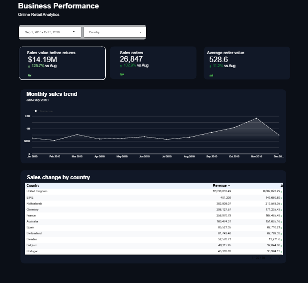
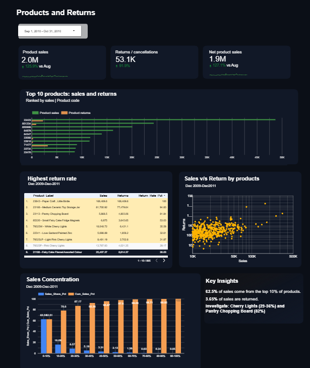
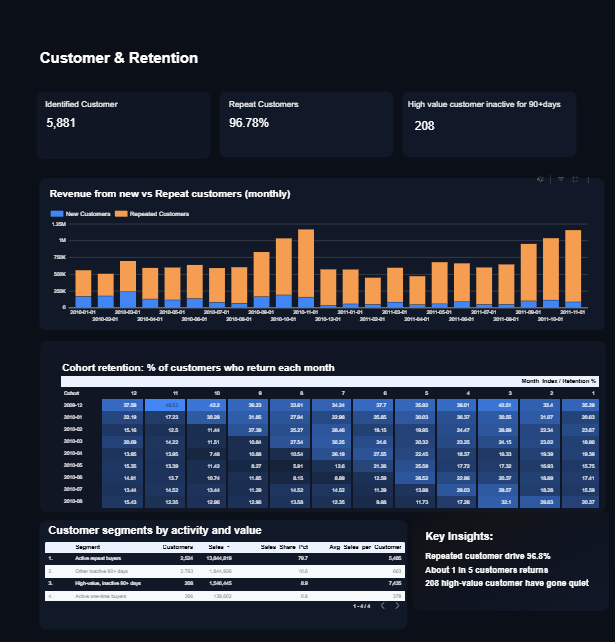

# Online Retail Analytics Dashboard

An end-to-end retail analytics project that turns transactional data into decision-focused business insights using **Python, Pandas, SQL and Google Looker Studio**.

The project covers the full workflow: raw-data profiling, cleaning and feature engineering, SQL-based validation/analysis, and a three-page interactive dashboard focused on **business performance, product returns, and customer retention**.

## Live Dashboard

**Google Looker Studio:**  
https://datastudio.google.com/u/0/reporting/60164f15-a31b-47ad-9da5-32b36bf2c133/page/y5C8F

> Make sure the Looker Studio report is shared with view access before using this link in a portfolio or resume.

## Business Questions Answered

### 1. Business Performance

- Is retail revenue growing or declining over time?
- Is the change in performance driven more by **order volume** or **average order value (AOV)**?
- Which countries contribute the most to revenue and changes in sales?
- How does the selected period compare with the previous period?

### 2. Products and Returns

- Which products generate the most sales?
- Which products have a high return value/rate relative to their sales?
- Are sales concentrated in a small number of products?

### 3. Customer and Retention

- How much business comes from **repeat customers** versus new customers?
- Which customer cohorts continue to return in later months?
- Which high-value customers have become inactive and may need re-engagement?

## Dashboard Pages

### Business Performance



This page tracks overall sales performance using revenue, order count, AOV, monthly trends, and country-level contribution/change.

### Products and Returns



This page connects product demand with return behavior. It highlights top-selling products, products with high return rates, sales-vs-return relationships, and product concentration.

### Customer & Retention



This page focuses on customer quality and retention through new-vs-repeat revenue, cohort retention, activity/value segmentation, and high-value customers inactive for 90+ days.

## Key Dashboard Insights

- The dashboard shows that the **top 10% of products contribute about 52.5% of sales**, indicating meaningful product concentration.
- Overall returns account for roughly **3.55% of sales** in the product analysis view.
- The product-return view flags selected products with unusually high return rates for investigation.
- Repeat customers are a major driver of the customer base/business shown in the dashboard, while the retention page also identifies **208 high-value customers inactive for 90+ days**.

## Dataset

The raw dataset contains **1,067,371 rows and 8 columns**, covering transactions from **December 2009 to December 2011**. After cleaning, the analysis dataset contains **1,033,036 rows and 10 columns**.

### Raw columns

`Invoice`, `StockCode`, `Description`, `Quantity`, `InvoiceDate`, `Price`, `Customer ID`, `Country`

### Added analytical fields

- `TransactionType` — classifies a row as `Sale` or `Return` based on quantity.
- `Revenue` — calculated as `Quantity × Price`.

The full raw and cleaned datasets are stored in compressed `.csv.gz` format under `data/`. Small 1,000-row CSV samples are included for quick inspection.

## Data Cleaning & Preparation

The Python notebook performs the following preparation steps:

1. Profiles the dataset structure, data types, descriptive statistics, missing values, and duplicates.
2. Removes **34,335 exact duplicate rows**.
3. Converts `InvoiceDate` to a proper datetime field.
4. Removes records with unusable core values such as missing date, price, or country.
5. Fills recoverable missing product descriptions using the most common description associated with the same `StockCode`.
6. Creates `TransactionType` to distinguish sales from returns/cancellations.
7. Creates `Revenue = Quantity × Price` for financial analysis.
8. Exports the cleaned dataset for downstream SQL and Looker Studio analysis.

Some `Customer ID` values remain missing in the cleaned transactional data, so customer-specific analysis is based on identified customers.

## SQL Analysis

SQL is used through `pandasql` for checks and exploratory business analysis such as:

- revenue by country,
- distinct customers by country,
- total revenue,
- top products by quantity,
- average quantity by country.

## Tools & Skills

- **Python**
- **Pandas**
- **NumPy**
- **SQL / pandasql**
- **Google Colab / Jupyter Notebook**
- **Google Looker Studio**
- Data cleaning and feature engineering
- KPI design and business analysis
- Product-return analysis
- Cohort and retention analysis
- Dashboard storytelling

## Repository Structure

```text
online-retail-analytics/
├── README.md
├── requirements.txt
├── data/
│   ├── README.md
│   ├── raw/
│   │   └── online_retail_II.csv.gz
│   ├── cleaned/
│   │   └── online_retail_II_cleaned.csv.gz
│   └── samples/
│       ├── raw_sample_1000_rows.csv
│       └── cleaned_sample_1000_rows.csv
├── dashboard/
│   ├── business_performance.png
│   ├── products_and_returns.png
│   └── customer_and_retention.png
├── notebooks/
│   └── online_retail_analysis.ipynb
└── src/
    └── analysis.py
```

## Run Locally

```bash
pip install -r requirements.txt
python src/analysis.py
```

Pandas can read the compressed datasets directly; manual extraction is not required.

## Project Objective

The goal of this project is not only to report retail KPIs, but to connect them to business decisions: **what is driving growth, which products require attention, and which customer groups should be retained or re-engaged**.
